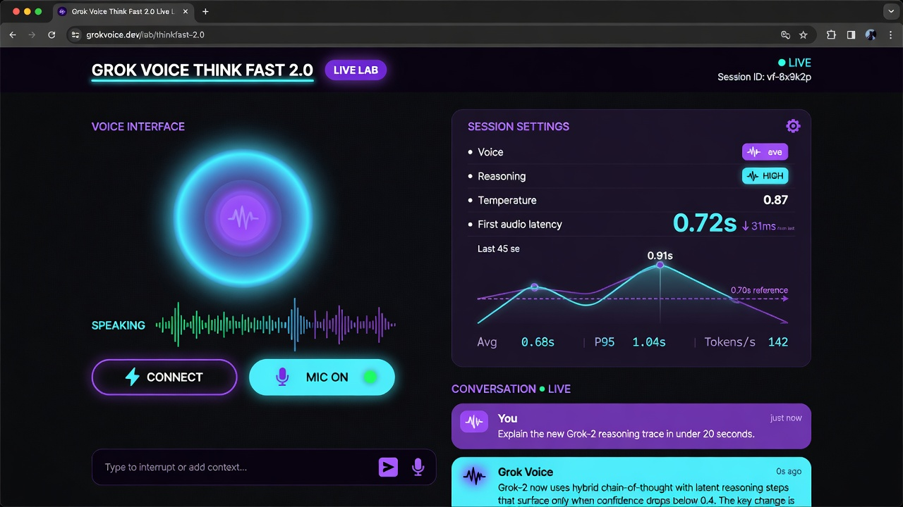

# Grok Voice Think Fast 2.0 // Live Lab

Interactive companion for [xAI Grok Voice Think Fast 2.0](https://x.ai/news/grok-voice-think-fast-2) — persistent speech-to-speech, offline demo, and reasoning **high vs none** A/B.

**Read the article → [`BLOG.md`](BLOG.md)**



## 30-second start

```bash
git clone https://github.com/cobusgreyling/Grok-Voice-Think-Fast-2.git
cd Grok-Voice-Think-Fast-2
python3 -m venv .venv && source .venv/bin/activate
pip install -r requirements.txt
python app.py
```

Open **http://127.0.0.1:7861** → click **▶ Demo mode** (no API key needed).

Optional live voice:

```bash
cp .env.example .env   # set XAI_API_KEY=xai-… from https://console.x.ai/
# restart python app.py → Connect
```

## What you can do

| Feature | How |
|--------|-----|
| **Offline Demo mode** | No key — replays recorded turns + audio + latency sparkline |
| **Compare high vs none** | Same prompt, two reasoning settings, side-by-side first-audio |
| **Live multi-turn** | **Connect** → text chat, streaming audio, mic + server VAD |
| **Friendly errors** | Missing key / mic blocked / network → plain English + fix command |
| **Scenarios** | Support, sales, reasoning, multilingual persona chips |

## Why this exists

Think Fast 2.0’s claim is simple: **reason while speaking** without the usual latency tax.

- Lab TTFA: **~0.70s** first audio (vs 1.25s on 1.0)
- Stronger conversational dynamics and agentic scores
- ~**0.4×** relative reasoning tokens vs 1.0

Details, benchmarks, and migration notes: **[BLOG.md](BLOG.md)**.

## Environment

| Variable | Default | Description |
|----------|---------|-------------|
| `XAI_API_KEY` | _(optional for demo)_ | Required for live Connect / mic / live compare |
| `XAI_VOICE_MODEL` | `grok-voice-think-fast-2.0` | Realtime model id |
| `XAI_VOICE` | `eve` | Default voice |
| `HOST` / `PORT` | `127.0.0.1` / `7861` | Bind |

## API

| Method | Path | Description |
|--------|------|-------------|
| `GET` | `/` | Live lab UI |
| `GET` | `/api/health` | Key / demo / features |
| `GET` | `/api/demo` | Offline fixture (turns + compare + PCM) |
| `GET` | `/api/examples` | Prompt chips + scenarios |
| `POST` | `/api/speak` | One-shot text → speech |
| `POST` | `/api/compare` | Reasoning high vs none (live or demo) |
| `WS` | `/ws/session` | Live Realtime proxy |

## Security

- Never commit `.env`.
- Demo mode ships synthetic tones (not production Grok audio).
- For browser-direct production clients, prefer [ephemeral tokens](https://docs.x.ai/developers/model-capabilities/audio/ephemeral-tokens).

## Stack

FastAPI · Uvicorn · websockets · vanilla HTML/CSS/JS

## Links

- Announcement: https://x.ai/news/grok-voice-think-fast-2  
- Docs: https://docs.x.ai/developers/model-capabilities/audio/voice-agent  
- Benchmarks: https://artificialanalysis.ai/speech-to-speech  

## License

MIT
